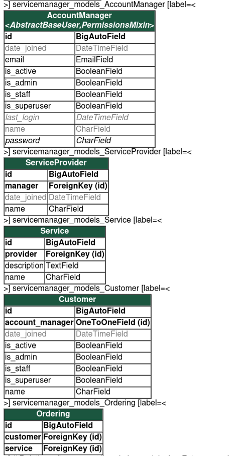

# digiplatform
A digital platform (CRM model) to offer and manage JePPIX services  

## Intro 
Designed a servicemanager app in digiplatform project using Django (MVT architecture) framework and Python. 
Developed models and deployed it on local system, added skeletal views and templates. 

## Models
In order to solve the problem as per constraints, designed below models

### Account Manager
An extension of django's AbstractBaseUser class.  
Each account manager is uniquely identified by email and is_admin (should be True for account manager objects) feilds. 
Has the capability to add customers.  
Can manage services offered by service providers using relations in following classes. 
Inherits MemberManager interface used to create and manage diffeerent types of users.

### Customer
Each customer is uniquely identified by email and has no special preiviliges. Is an extension of models.Model and can only be created by AccountManager
Has many to one relationship with Account Manager (as one customer can have only one accoutn manager while account manager can create many customers)
Has many to many relationship with Service, through Ordering ( One cusotmer can require many services, each service may be required by many customers) 
Corresponding account manager can be updated using views based on service requirements. 

#### Member Manager
Interface to create different types of users
Used by Account Manager, Customer 

### Service Provider
Uniquely identified by name 
Has many to one relationship with Account Manager ( one Account Manager can manager multiple Service Providers, but one Service Provider can safely be manager by one Account Manager)

### Service
Uniquely identified by name and detailed using description feilds. 
Has many to one relationship with Service Provider (Because one service can be managed by single Service provider while each provider can provide multiple services)

### Ordering
Maintains connections between Services and Customers 

Designed custom UserAdmin classe in admin.py and 
UserCreation and UserChange forms in forms.py and registered models with admin to deploy smoothly.

Enabled http://localhost:8000/servicemanager on local machine which can be improved and extended later. 


## Steps to run from any computer

1. Clone the repo
3. Create a virtual environment and install requirements
4. In the project directory, use 
```
py manage.py runserver
```
4. Create your own superuser
'''
py manage.py createsuperuser
'''
Navigate to
```
localhost:8000/ and
localhost:8000/admin // using super user credentials 
```


